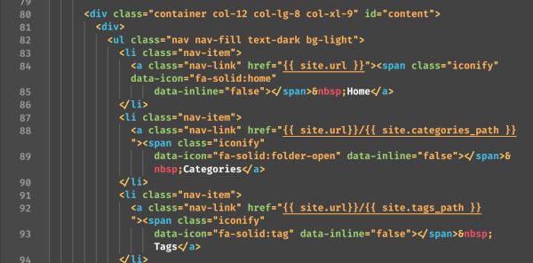
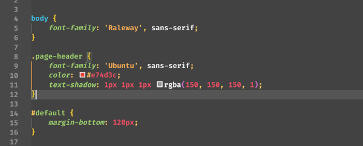
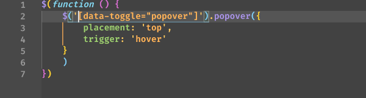
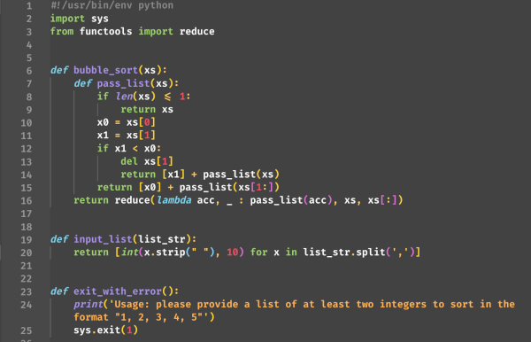
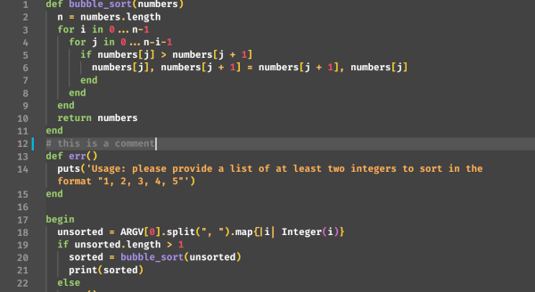
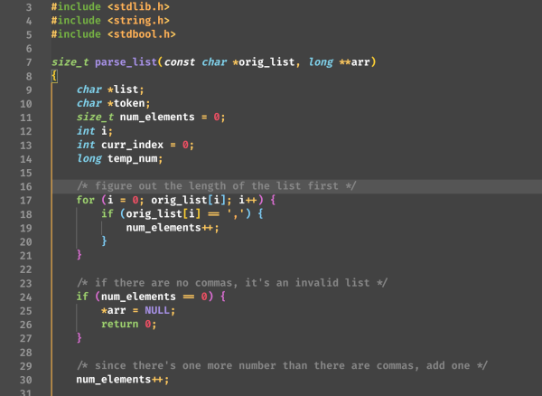
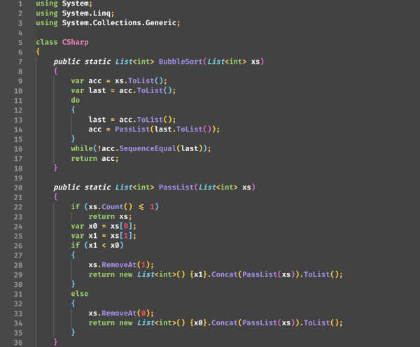

# EyeHealth Theme

Eye protection theme for Visual Studio Code.

VSCode Marketplace：[https://marketplace.visualstudio.com/items/jonathanhild.eyehealth](https://marketplace.visualstudio.com/items/jonathanhild.eyehealth)

GitHub Repo: [https://github.com/jonathanhild/eyehealth/](https://github.com/jonathanhild/eyehealth/)

## What's new

Click here to go to the [Changelog](https://github.com/jonathanhild/IKKI-Plus/blob/master/CHANGELOG.md)

## Previews

### HTML

### CSS

### Javascript

### Python

### Ruby

### C/C++

### C\#

## Acknowledgements

EyeHealth is based on IKKI VSCode Dark Theme [https://github.com/IKKI2000/IKKI-VSCode-Dark-Theme/](https://github.com/IKKI2000/IKKI-VSCode-Dark-Theme/)
